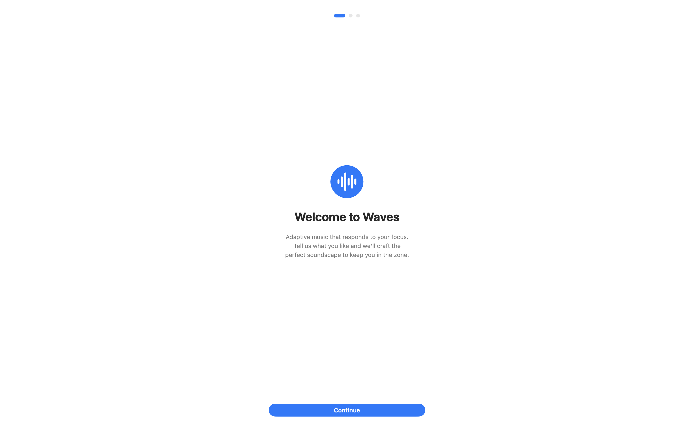

# Waves

AI-generated music that adapts to your focus.

Waves is a macOS app that generates real-time adaptive music using Google's Lyria Realtime API. Music evolves continuously based on your focus session progress, voice commands, and the app you're currently using.

## Features

### Wave Sessions

Timed focus sessions ranging from 1 to 60 minutes. Music intensity follows a smooth easing curve that ramps up through the first 75% of the session, then gently winds down. The intensity automatically drives BPM (60–150), density, brightness, and the balance between calm and intense prompts.

### Free Play

Open-ended mode with manual prompt input and a BPM slider (60–200). Optionally enable app-based routing so the music changes automatically when you switch between apps.

### Voice Steering

Speak natural-language commands like "make it more chill" or "switch to jazz piano." Speech is transcribed on-device, sent to Gemini for intent classification, and applied to the live music stream in real time. You can also tell it to "block instagram" or "allowlist spotify".

### FocusGuard

Monitors your active app and browser URL during Wave sessions. Supports both blocklist and allowlist modes. When you wander to a blocked site, the music fades out over a 10-second grace period and a refocus notification fires. Return to an allowed context and the session resumes.

### App Music Routing

Automatically switches the music prompt based on what you're doing. Coding in Xcode or Cursor gets high-energy EDM. Writing in Obsidian or Notion gets chill ambient. Social media gets upbeat pop. Rules are fully customizable.

### Menu Bar Controls

A compact menu bar popover gives you quick access to wave progress, the current prompt, a steering text field, and a voice input button without switching windows.

## AI Under the Hood

### Lyria Realtime

A persistent WebSocket connection to Google's Lyria model (`lyria-realtime-exp`) streams audio in real time. The app sends text prompts with weights, BPM, density, brightness, temperature, and guidance parameters. Lyria returns base64-encoded audio chunks that are decoded and played back continuously through `AudioPlayer`.

### Gemini 2.5 Flash

Handles intent classification for voice and text steering input. Every command is classified into one of three intents:

- **steer_music** — style or mood change applied to Lyria prompts
- **block** — add a domain or app to FocusGuard's blocklist
- **unblock** — remove a domain or app from FocusGuard's blocklist

The model uses structured JSON output with temperature 0 for deterministic, consistent results.

### Adaptive Parameters

During Wave sessions, a normalized intensity value (0 → 1 → 0) drives all music parameters through easing curves:

| Parameter | Low intensity | High intensity |
|-----------|--------------|----------------|
| BPM | 60 | 150 |
| Density | 0.1 | 0.9 |
| Brightness | 0.2 | 0.8 |
| Calm prompt weight | 1.0 | 0.1 |
| Intense prompt weight | 0.1 | 1.0 |

Parameters are pushed to Lyria every 5 seconds, with a full BPM reset when the change is significant.

## Getting Started

### Requirements

- macOS
- Xcode
- A [Gemini API key](https://aistudio.google.com/apikey)

### Setup

1. Clone the repository
2. Open `Waves.xcodeproj` in Xcode
3. Build and run
4. Complete onboarding (select your preferred genres and mood)
5. Enter your Gemini API key in Settings

## Architecture

| File | Role |
|------|------|
| `WavesApp.swift` | Entry point, onboarding routing, menu bar extra |
| `AppState.swift` | Central state management — Lyria, audio, sessions, steering |
| `WaveSession.swift` | Focus session state machine and intensity curve |
| `LyriaService.swift` | WebSocket client for Lyria Realtime |
| `GeminiService.swift` | Gemini API client for intent classification |
| `FocusGuard.swift` | Active app/site monitoring during focus sessions |
| `AppMusicRouter.swift` | Context-aware automatic music prompt switching |
| `SpeechRecognizer.swift` | On-device speech-to-text |
| `MusicPreferences.swift` | Genre and mood preferences, prompt generation |
